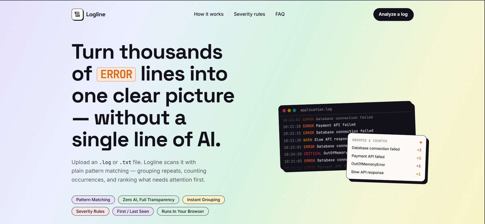

<div align="center">

# Logline

**Error Log Analyzer — MVP**

Upload a `.log` / `.txt` file or paste log text directly. Parsed with plain regular
expressions — grouped, counted, and ranked by severity. No AI involved, by design.




</div>

---

## Features

| Input | Analysis | Output |
|---|---|---|
| Drag-and-drop or click-to-upload `.log` / `.txt` files, plus a bundled sample | Server-side rule-based parsing (`lib/logParser.ts`) — level detection, message normalization, grouping, severity classification | Dashboard: total lines, error / critical / warning counts, unique error count |
| Side-by-side paste box for raw log text — same endpoint, same analysis | Editable severity rules table (`SEVERITY_RULES`) | Ranked "Top errors" list with occurrence counts and detail panel per error |

- Detail panel per error: severity, log level, first/last occurrence, raw sample line
- Fully responsive, keyboard-accessible, `prefers-reduced-motion` respected

## Tech stack

<div align="center">

<a href="https://nextjs.org"></a>

</div>

## Getting started

```bash
git clone <your-repo-url>
cd log-analyzer
npm install
npm run dev
```

Open [http://localhost:3000](http://localhost:3000).

## Project structure

```text
app/
  api/analyze/route.ts         # POST endpoint — receives a file, returns AnalysisResult JSON
  page.tsx                     # Landing + upload + results, single-page flow
  layout.tsx                   # Fonts, metadata
components/                    # Hero, upload dropzone + paste box, dashboard, detail panel, etc.
lib/logParser.ts               # Core rule-based parsing engine + severity rules config
next.config.mjs                # React strict mode; explicit Turbopack root (this project dir)
public/sample/application.log  # Sample log used by "Try sample log"
```

## Extending severity rules

Edit `SEVERITY_RULES` in `lib/logParser.ts` — a flat, ordered list of
`{ pattern, severity }` pairs matched top-to-bottom against each error's level + message.

## Deployment

This is a standard Next.js app — deploy it anywhere Next.js is supported.

### Vercel (recommended)

```bash
npm i -g vercel
vercel
```

Or connect the repo at [vercel.com/new](https://vercel.com/new) — no environment variables
are required, and the default build command (`next build`) works out of the box.

### Any Node host

```bash
npm run build
npm run start
```

## What is intentionally not in this MVP

Per the product spec: no AI-based explanations, no authentication, no real-time monitoring,
no cloud log integrations, and no persistence layer. Logs are parsed for the length of the
request and never stored.

---

<div align="center">

**Made by MRD with love**

</div>
