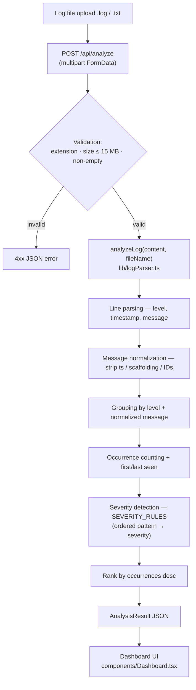

# Architecture — Error Log Analyzer

Rule-based log file analysis. No AI: regular expressions and ordered rule tables only.

## Flow

## Key pieces

| Piece | Location | Role |
|---|---|---|
| Parsing engine | `lib/logParser.ts` | Pure functions: `parseLine`, `analyzeLog`. No I/O. |
| Severity rules | `SEVERITY_RULES` in `lib/logParser.ts` | Flat, ordered `{ pattern, severity }` list; first match wins |
| API endpoint | `app/api/analyze/route.ts` | Validation boundary; Node.js runtime |
| Upload UI | `components/UploadCard.tsx` | Drag-and-drop box + paste box (both wrap input into a `File`) |
| Results UI | `components/Dashboard.tsx` | Stat cards, ranked error list, detail panel |

## Design constraints

- Stateless: logs are parsed for the duration of the request, never stored.
- Grouping is deterministic: identical messages with different timestamps collapse to one entry.
- Severity rules are data, not code — extending analysis means editing a list.
