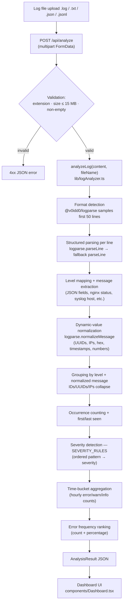

# Architecture — Error Log Analyzer

Rule-based log file analysis. No AI: regular expressions, ordered rule tables, and
[`@v0idd0/logparse`](https://www.npmjs.com/package/@v0idd0/logparse) for multi-format detection only.

## Flow



## Key pieces

| Piece | Location | Role |
|---|---|---|
| Types + severity rules | `lib/logParser.ts` | `LogLevel`, `Severity`, `ErrorGroup`, `AnalysisResult` types; `SEVERITY_RULES` config; fallback `parseLine` (client-safe, no `fs`) |
| Enhanced analyzer | `lib/logAnalyzer.ts` | Server-only: imports `@v0idd0/logparse` for format detection + structured parsing; applies our severity rules; builds time buckets + frequency ranking. Falls back to `parseLine` for unsupported formats. |
| API endpoint | `app/api/analyze/route.ts` | Validation boundary; Node.js runtime; accepts `.log`, `.txt`, `.json`, `.jsonl` |
| Upload UI | `components/UploadCard.tsx` | Drag-and-drop box + paste box (both wrap input into a `File`) |
| Results UI | `components/Dashboard.tsx` | Stat cards, format indicator, severity filter, time-bucket summary, ranked error list, detail panel |
| Detail panel | `components/ErrorDetailPanel.tsx` | Slide-over: severity, level, first/last occurrence, normalized signature, raw sample |

## Parsing pipeline

```
Raw Log
  → Format Detection (logparse samples first 50 lines → json/nginx/apache/syslog/text/unknown)
  → Structured Parsing (logparse.parseLine per line, with fallback to regex parseLine)
  → Level Mapping (logparse levels → our LogLevel; nginx/apache HTTP status → level)
  → Message Extraction (JSON fields, request+status for HTTP, raw message for text)
  → Normalization (logparse.normalizeMessage: UUIDs, IPs, hex, timestamps, numbers)
  → Error/Warning Detection (level ∈ ERROR | CRITICAL | FATAL)
  → Grouping (level + normalized message as key → collapses dynamic values)
  → Severity Classification (SEVERITY_RULES ordered pattern matching)
  → Time Buckets (hourly aggregation of error/warn/info counts)
  → Error Frequency (ranked list with count and percentage)
  → AnalysisResult JSON → Dashboard UI
```

## Design constraints

- Stateless: logs are parsed for the duration of the request, never stored.
- Grouping is deterministic: identical messages with different timestamps collapse to one entry.
- Severity rules are data, not code — extending analysis means editing a list.
- `lib/logParser.ts` is client-safe (no `fs`); `lib/logAnalyzer.ts` is server-only.
- Graceful fallback: unrecognized formats fall back to the regex-based `parseLine`.
- Original log lines are always preserved in `sampleRaw` for verification.
