# Architecture — Error Log Analyzer

Rule-based log file analysis with semantic error clustering. Local embeddings via
[`@huggingface/transformers`](https://www.npmjs.com/package/@huggingface/transformers)
(`Xenova/all-MiniLM-L6-v2`), no cloud AI, no paid API.

## Flow

```mermaid
flowchart TD
    A[Log file upload .log / .txt / .json / .jsonl] --> B["POST /api/analyze<br/>(multipart FormData)"]
    B --> C{Validation:<br/>extension · size ≤ 15 MB · non-empty}
    C -- invalid --> C1[4xx JSON error]
    C -- valid --> D["analyzeLog(content, fileName)<br/>lib/logAnalyzer.ts"]
    D --> E[Format detection<br/>@v0idd0/logparse samples first 50 lines]
    E --> F[Structured parsing per line<br/>logparse.parseLine → fallback parseLine]
    F --> G["Level mapping + message extraction<br/>(JSON fields, nginx status, syslog host, etc.)"]
    G --> H["Dynamic-value normalization<br/>logparse.normalizeMessage<br/>(UUIDs, IPs, hex, timestamps, numbers)"]
    H --> I["Grouping by level + normalized message<br/>IDs/UUIDs/IPs collapse"]
    I --> J[Occurrence counting + first/last seen]
    J --> K["Severity detection — SEVERITY_RULES<br/>(ordered pattern → severity)"]
    K --> L["Time-bucket aggregation<br/>(hourly error/warn/info counts)"]
    L --> M["Error frequency ranking<br/>(count + percentage)"]
    M --> N["AnalysisResult JSON"]
    N --> O["Semantic analysis — analyzeIssues()<br/>lib/issueAnalyzer.ts"]
    O --> P["Fingerprinting<br/>lib/fingerprint.ts<br/>(strip dynamic values, detect category/services)"]
    P --> Q["Embedding generation<br/>lib/embeddings.ts<br/>(all-MiniLM-L6-v2 via @huggingface/transformers)"]
    Q --> R["Clustering<br/>lib/clustering.ts<br/>(cosine similarity + Union-Find)"]
    R --> S["Issue model generation<br/>(human-readable titles, confidence scores)"]
    S --> T["Dashboard UI<br/>components/IssueDashboard.tsx"]
```



## Key pieces

| Piece | Location | Role |
|---|---|---|
| Types + severity rules | `lib/logParser.ts` | `LogLevel`, `Severity`, `ErrorGroup`, `AnalysisResult`, `Issue`, `SemanticAnalysisResult` types; `SEVERITY_RULES` config; fallback `parseLine` (client-safe, no `fs`) |
| Enhanced analyzer | `lib/logAnalyzer.ts` | Server-only: imports `@v0idd0/logparse` for format detection + structured parsing; applies our severity rules; builds time buckets + frequency ranking |
| Fingerprinting | `lib/fingerprint.ts` | Strips dynamic values (UUIDs, IPs, hex, paths, timestamps, large numbers); detects error categories (Connection, Timeout, Permission, etc.) and affected services |
| Embedding generation | `lib/embeddings.ts` | Local embedding via `@huggingface/transformers` (`Xenova/all-MiniLM-L6-v2`, 384-dim). Fingerprint-based caching to avoid re-embedding identical messages. Lazy singleton model loading. |
| Clustering engine | `lib/clustering.ts` | Cosine similarity computation + Union-Find single-linkage clustering. Threshold-based (default 0.72). Modular — swap clustering algorithm without changing pipeline. |
| Semantic analyzer | `lib/issueAnalyzer.ts` | Full pipeline: ErrorGroup[] → fingerprint → embed → cluster → Issue[]. Generates human-readable titles, categories, confidence scores. Falls back to fingerprint-only grouping if embeddings unavailable. |
| API endpoint | `app/api/analyze/route.ts` | Validation boundary; Node.js runtime; returns `AnalysisResult` + `SemanticAnalysisResult` |
| Upload UI | `components/UploadCard.tsx` | Drag-and-drop box + paste box (both wrap input into a `File`) |
| Issue dashboard | `components/IssueDashboard.tsx` | Issue-centric results: stat cards, format/semantic indicators, severity filter, time-bucket summary, ranked issue list |
| Issue detail panel | `components/IssueDetailPanel.tsx` | Slide-over: title, severity, category, confidence, affected services, occurrences, expandable "Technical Details" with related variants and raw samples |

## Semantic analysis pipeline

```
ErrorGroup[]
  → Fingerprinting (lib/fingerprint.ts)
    → Strip dynamic values: UUIDs, IPs, hex addresses, timestamps, paths, large numbers
    → Detect error category: Connection, Timeout, Permission, Authentication, etc.
    → Detect affected services: PostgreSQL, Redis, MongoDB, etc.
    → Generate normalized fingerprint string for exact-match deduplication
  → Deduplication (exact fingerprint match)
  → Embedding generation (lib/embeddings.ts)
    → all-MiniLM-L6-v2 via @huggingface/transformers (ONNX, 384-dim, ~23MB model)
    → Fingerprint-based caching (identical fingerprints share one embedding)
    → Lazy model loading (singleton, downloads once, stays in memory)
  → Clustering (lib/clustering.ts)
    → Cosine similarity between all fingerprint embeddings
    → Union-Find single-linkage clustering (threshold = 0.72)
    → O(n²) pairwise comparison — acceptable for typical error group counts (< 1000)
  → Issue model generation (lib/issueAnalyzer.ts)
    → Human-readable title from category + services
    → Severity: worst across cluster
    → Confidence: average pairwise similarity within cluster (or 1.0 for single-fingerprint clusters)
    → Affected services, related variants, raw samples
    → Sorted: severity → occurrences → confidence
  → SemanticAnalysisResult JSON → IssueDashboard UI
```

## Design constraints

- **Stateless**: logs are parsed for the duration of the request, never stored.
- **No cloud AI**: all inference runs locally via ONNX. Model downloaded once from Hugging Face Hub (open-source, no API key).
- **Modular clustering**: cosine similarity threshold and clustering algorithm are swappable without changing the pipeline.
- **Graceful fallback**: if embeddings are unavailable, falls back to fingerprint-only grouping.
- **Deduplication**: identical fingerprints share one embedding (cache/reuse), avoiding redundant computation.
- **Grouping is deterministic**: identical messages with different timestamps collapse to one entry.
- **Severity rules are data, not code**: extending analysis means editing a list.
- **`lib/logParser.ts` is client-safe** (no `fs`); `lib/logAnalyzer.ts`, `lib/fingerprint.ts`, `lib/embeddings.ts`, `lib/clustering.ts`, `lib/issueAnalyzer.ts` are server-only.
- **Original log lines are always preserved** in `sampleRaw` for verification.
