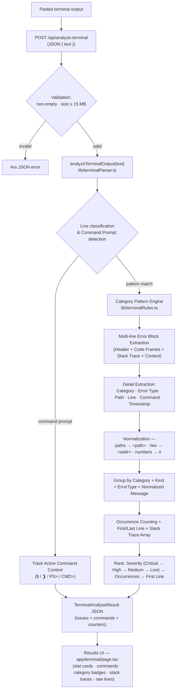

# Architecture — Terminal Error Analyzer

Rule-based terminal and command output analysis. 100% deterministic, local execution without AI: regular expressions, category rule tables, and multi-line block grouping only.
Shares the visual language and `Severity` type with the Error Log Analyzer; parsing and category classification are separate.

## Flow

## Key pieces

| Piece | Location | Role |
|---|---|---|
| Rule-based Pattern Library | `lib/terminalRules.ts` | Extensible rules table (`TERMINAL_CATEGORY_RULES`) for 15 error categories, regex patterns, per-rule explanations, extractors for stack frames, file paths, and line numbers. |
| Multi-line Parsing Engine | `lib/terminalParser.ts` | Multi-line block extractor (`analyzeTerminalOutput`), command context tracking, stack trace grouping, message normalization, and issue ranking. |
| API Endpoint | `app/api/analyze-terminal/route.ts` | Request validation (15 MB limit); Node.js runtime execution. |
| Results Dashboard | `app/terminal/page.tsx` | UI rendering stats, category chips, source file/line tags, command tags, collapsible stack trace viewer, and original terminal lines. |
| Shared Components | `components/StatCard`, `components/SeverityChip`, `components/Nav`, `components/Footer` | Reused design components. |

## Supported Categories & Detection Rules

1. **Command Error**: Unknown/not-found commands, "not recognized as a cmdlet / internal or external command" (PowerShell, CMD), npm/yarn/pnpm unknown commands, invalid or unsupported options/subcommands, missing required arguments.
2. **Runtime Error**: Unhandled JS/TS exceptions, `TypeError`, `ReferenceError`, `SyntaxError`, `RangeError`, Rust panics.
3. **Build / Compile**: TypeScript `TS\d+` errors, `gcc`/`clang`/`g++` compile errors, Rust `rustc[E\d+]` errors, Webpack / Vite build failures.
4. **Package Manager**: `npm ERR!`, `yarn error`, `ERR_PNPM_`, `ERESOLVE` dependency conflicts, `ELIFECYCLE` script failures.
5. **Python**: `Traceback (most recent call last):`, `ModuleNotFoundError`, `ImportError`, `IndentationError`, `SyntaxError`, Python runtime exceptions.
6. **Java / Maven / Gradle**: `Exception in thread`, `java.lang.*`, `BUILD FAILED`, `Gradle build failed`, Maven `[ERROR]` goals, `ClassNotFoundException`.
7. **Git**: `fatal: not a git repository`, `fatal: destination path`, `error: failed to push some refs`, `CONFLICT (content):` merge conflicts.
8. **Next.js / React**: Hydration failures, `Invalid hook call`, `Fast Refresh` reloads, `ChunkLoadError`, Next.js server errors.
9. **Docker / Container**: `Cannot connect to the Docker daemon`, `Error response from daemon`, build step failures (`failed to solve: process`), container exit codes.
10. **Database / Connection**: `ECONNREFUSED`, `ECONNRESET`, `MongoNetworkError`, `SequelizeConnectionError`, MySQL / PostgreSQL / Redis / SQLite connection failures.
11. **Permission / Access**: `EACCES`, `EPERM`, `Permission denied`, `403 Forbidden`, `Access denied for user`, `sudo required`.
12. **Network / API**: `ETIMEDOUT`, `ENOTFOUND`, `getaddrinfo`, `502 Bad Gateway`, `504 Gateway Timeout`, `500 Internal Server Error`, `fetch failed`, CORS errors.
13. **Dependency / Module**: `Cannot find module`, `Module not found`, `No module named`, `Could not find a declaration file`.
14. **Port / Process**: `EADDRINUSE`, `address already in use`, `Segmentation fault`, `heap out of memory`, `SIGKILL`, `SIGSEGV`.
15. **Warning / Deprecation**: `DeprecationWarning`, `ExperimentalWarning`, `npm WARN`, `Warning: React...`.

## Design Constraints & Guarantees

- **Stateless & Deterministic**: Terminal output is analyzed strictly in-memory during request handling and never stored.
- **No AI / External API Dependencies**: 100% offline rule-based regex parsing.
- **Multi-line Block Grouping**: Group header, code frame snippet, and stack trace lines into a single issue entity instead of fragmenting into individual line errors.
- **Deduplication**: Volatile tokens (timestamps, hex addresses, line numbers, paths) are normalized so recurring terminal errors group into single ranked items with occurrence counts.
