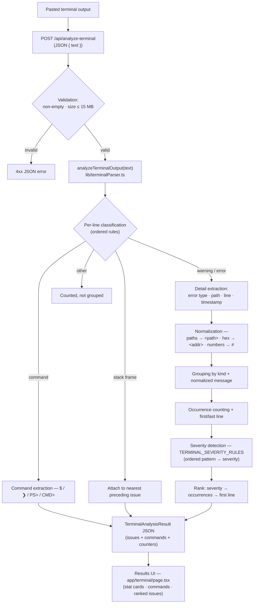

# Architecture — Terminal Error Analyzer

Rule-based terminal/command output analysis. No AI: regular expressions and ordered rule tables only.
Shares the visual language and `Severity` type with the Error Log Analyzer; parsing is separate.

## Flow

## Key pieces

| Piece | Location | Role |
|---|---|---|
| Parsing engine | `lib/terminalParser.ts` | Pure functions: `classifyLine`, `analyzeTerminalOutput`. No I/O. |
| Severity rules | `TERMINAL_SEVERITY_RULES` in `lib/terminalParser.ts` | Flat, ordered pattern → severity list; first match wins |
| API endpoint | `app/api/analyze-terminal/route.ts` | Validation boundary; Node.js runtime; JSON body (not FormData) |
| Page | `app/terminal/page.tsx` | `/terminal` route: paste box, Analyze button, results dashboard |
| Shared components | `components/StatCard`, `components/SeverityChip`, `components/Nav`, `components/Footer` | Reused unchanged |

## Design constraints

- Stateless: pasted output is analyzed in-request, never stored.
- Grouping is deterministic: volatile details (paths, addresses, IDs) are normalized away,
  so recurring failures collapse into one ranked issue.
- "Most important first" = severity rank, then occurrence count — not chronological order.
